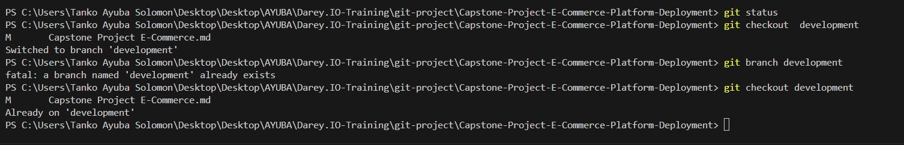

## Capstone Project: E-Commerce Platform Deployment with Git, Linux, and AWS

### Project Introduction
I am assigned to develop an e-commerce website for a new online marketplace, and they should be "MarketPeak". The platform should feature product listings, a shopping cart, and user authentication. I am to utilize git for my version control, develop the platform in a Linux environment, and then, deploy it onAWS EC2 instance.

### 1. Implement Version Control with Git
#### 1.1 Initialize Git Repository
I started the project by creating a directory and named it "MarketPeak_Ecommerce", and I initialized a Git repository inside the directory to help manage the version control via the use of Git.

I launched the git and navigated to the directory where I intended to create the project directory, and I used the "mkdir" command to create the directory inside the directory, as shown below.

    - `mkdir MarketPeak_Ecommerce`

I have to use the change directory "cd" command to enter the directory and also use the "git init" command to initialize the Git repository to manage my version control as shown below.

    - `cd MarketPeak_Ecommerce`

    - `git init`

### Print Screen of MarketPeak_Ecommerce directory created, and Git initialization

#### 1.2 Obtaining and Preparing the E-Commerce Website Template
In this project, I will be using a pre-existing e-commerce website template downloaded from a specific template instead of developing an E-commerce website from scratch to allow me to focus on the deployment and operational aspects.

- I downloaded the E-commerce template and extracted the template into the MarketPeak_Ecommerce directory via the use of the command below,

- `cp Desktop/Desktop/2129_crispy_kitchen Desktop/Desktop/AYUBA/Darey.IO-Training/git-project/MarketPeak_Ecommerce/`

#### Print Screen of the Copied E-commerce template into the MarketPeak_Ecommerce Directory

NOTE: Since I do not have strong development skills, I have decided to use the e-commerce template the same way I downloaded it.

#### 1.3 Stage and Commit the Template to Git

i.  I added the website files to the Git repository using the "git add." command to stage the files as shown below.
    
 - `git add .`

ii. I set the Git global configuration with my username and email using the global commands as shown below,

##### Git config --global usr.name "YourUsername" 

I used the (Git config --global user.name "Your user name") command to set my Git username as shown below.

 - `git config --global user.name "tasbaba"

I then used the (Git config --global user.email "Your email") command to set my emaill address associated with my Git commit globally as shown below.

 - `git config --global user.email "tasayuba@yahoo.com"`

#### git commit -m

In other to commit my created files, I use the "git commit -m" command to commit the files to my git repository with a message describing the changes made as shown below.

 - `git commit -m "Initial commit with basic e-commerce site structure"`

#### Print screen showing the used commands i.e git add ., git config --global, and git commit -m

#### 1.4 Push the code to GitHub Repository

After I had initialized my git repository I added and committed the e-commerce website template. The next step will be for me to push my file and codes to the remote repository on my Github as this step is important for version control and collaboration.

- In order to push the files and code to my remote GitHub repository, I will have to do the following.

#### Create a remote Repository on GitHub

 i.  I will log into my GitHub account create a new repository, and name it "MarketPeak_Ecommerce" and the repository should be left empty without a README, gitignone, or licence.

 - See the print screen below for the new MarketPeak_Ecommerce created repository

- Click on the + to create new repository

    

- Give the new repository a name, and click on the create repository green button as show below.

    

#### Link my Local Repository to Github

From my terminal, in my project directory, I will add the remote repository URL of my created repository to my local repository configuration via the use of the below command.

` git remote add origin https://github.com/Tasbaba/MarketPeak_Ecommerce.git`

- Print Screen hit remote add origin

#### Push my Code and Files

In other to push my local repository content to my Github repository, I will have to use the below "git push -u" command.

    `git push -u origin master`

- Print screen for git push command

### - Challenge Encounter
I have successfully pushed my code and file to my Git Repository, but I had a challenge of not Identifying the correct push command while I was using the "git push -u origin main" command instead of the "git push -u origin master" command and immediately is used this command I was able to push my code and files. 

### 2 AWS Deployment

To deploy my "MarketPeak_Ecommerce" platform in AWS, I will have to set up my AWS EC2 instance to successfully deploy the platform by implementing the below.

#### 2.1 Setup AWS EC2 Instance

- I have to log in to the AWS Management Console and launch my EC2 instance using AMI Amazon Linux by connecting to the instance using SSH as the snapshot shows it below.

- Log in to the AWS Management Console and Launch the EC2 instance via AMI Linux.

    - log in via AMI User

    - Launching the EC2 Instance to give access for SSH

- Connecting to the instance using SSH, and I used the "SSH" command below to Launch the Linux instance, and see print screen below on my practical action.

    - `ssh -i "darey.pem" ubuntu@ec2-52-203-86-28.compute-1.amazonaws.com`

### 2.2 Clone the repository on the Linux Server

For a successful deployment of my E-commerce platform, I will have to clone the GitHub repository on my AWS EC2 instance Linux server by authenticating with GitHub using the primary method to clone the repository through the HTTPS  or SSH link copied from my GitHub repository.

- I will navigate to the repository in my GitHub console, as seen on the below print screen.

- Navigate to the MarketPeak-Ecommerce project, select the code button in green as highlighted below, and then copy the HTTPS link to clone the project on the AWS EC2 instance Linux server.

- The HTTPS link from the GitHub repository

	`https://github.com/Tasbaba/MarketPeak_Ecommerce.git`

    Select the "MarketPeak_Ecommerce Project print Screen

    

- From the selected "MarketPeak_Ecommerce" project click on the green code button as shown below.

    

-   Once the green code button is clicked, select the HTTPS tap as highlighted below, and I copy the link to enable me use the link to clone the Github repository in the AWS EC2 instance as shown below and on the print screen as well but I will officially use the SSH to clone for my learning purpose.

    

I used the below "git clone" command for HTTPS, but it returned a fatal that the destination path 'MarketPeak_Ecommerce' already exists, but I have cloned it already using the SSH link.

`git clone https://github.com/Tasbaba/MarketPeak_Ecommerce.git`

### Actual method I used to clone on my AWS EC2 instace is the SSH Method

- I access my EC2 instance Linux server to generate SSH keypair the use of this "ssh-keygen" command as seen below and on the print screen.

    `ssh-keygen`

   - Generating SSH-Key

- I then used the command below to access the generated SSH key at the location it was stored on my local system and copied the key as shown above.

    `cat /home/ubuntu/.ssh/id_ed25519.pub`

I launched my GitHub console, navigated to the settings, and selected the SSH and GPG Key, I pasted the copied SSH generated key in the Key box and clicked on the Add SSH key as shown below.

- Navigate Settings

- Select SSH and GPG Key

- Snapshot showing the key box to paste my generated key and click on the Add SSH key.

- Once I have added the new SSH key for the MarketPeak_Ecommerce, I navigate the GitHub console to the project click on the green code button, select the SSH tap, and then copy the link to enable me to perform the clone action as shown below.

I then use the command below to perform my clone action, as seen on the print screen below.

`git clone git@github.com:Tasbaba/MarketPeak_Ecommerce.git`

### 2.3 Install a Web Server on EC2

Apache HTTP server (httpd) is a well-known and used ser server that serves HTTP files and content over the internet, I will have to install it on my Linux EC2 server to enable me to host the MarketPeak E-commerce site.

In other to successfully install the Apache (httpd) on the EC2 Linux server, I will have to run the below set of commands.

    - `sudo apt update -y`
    - `sudo apt install apache2 -y`
    - `sudo apt systemctl start apache2`
    - `sudo apt systemctl enable apache2`

The shared command is for the yum package manager, and for the project, I use the Ubuntu Linux machine the commands I used are the above listed which is meant for Ubuntu servers, and not the below commands.

    - `sudo yum update -y`
    - `sudo yum install httpd -y`
    - `sudo yum systemctl start httpd`
    - `sudo yum systemctl enable httpd`

- Print screen for apt update

- Print screen for Installing Apache

- Print screen for starting Apache

- Print screen for enabling Apache

After the installation and update of Apache2 are completed, the next action is configuring Apache2 for the website.

### 2.4 Configure Apache2 for the Website

To serve the website from my EC2 instance, I have to configure Apache2 to point to the directory on my Linux server where the website code files are stored. 

Firstly, I will have to prepare the web Directory, by clearing the default Apache2 web directory, and then copy "MarketPeak Ecommerce website files into it by using the below set of commands.

    -   `sudo rm -rf /var/www/html/*`
    -   `sudo cp -r ~/MarketPeak_Ecommerce/* /var/www/html/`

- I will now have to reload the Apache2.
The reason for the reload is to apply the changes for the Apache services by using the below command and see the reload print screen.

    -   `sudo systemctl reload apache2`

### 2.5 Access Website from Browser 

After I reloaded the apache2, the website files are in place, and the MarketPeak E-commerce platform is now live on the internet.

I then open Edge and Chrome browser copy the public IP from my EC2 instance, and paste it on the browser to view the deployed website as seen below.

- [hosted-Website](./images/picture.jpg)
    
### 3 Continuous Integration and Deployment Workflow

In other to ensure a smooth workflow for developing, testing, and deploying my e-commerce platform, I will continually follow this structured approach.

This ensures making changes in the development environment, utilizing version control with Git, and deploying updates to my production server on AWS.

### Step 1: Developing New Features and fixes

- Create a Development Branch

I will start the development work by creating a separate branch to isolate new features and bug fixes from the stable version of my website.

- To create a development branch, I will use the below command.

    - `git branch development`

- To switch the development branch I will use the command below.

    - `git checkout development`

- Print screen of the created branch and switching to the "development" branch

### Step 2: Version Control with Git

- Stage My changes will come after I have made all required changes, and I will add the change to the staging area in git. This will prepare the changes for a commit.
I use the below git command to add the changes.

    - `git add .`

- I commit my changes to securely save my changes in the git repository with the below git command, and I include a description of my update before I commit the changes.

    - `git commit -m "the new created branch'`

- Push changes to GitHub to enable me to upload my development branch with the new changes to GitHub and to allow collaboration and version control via the use of the below command, as shown on the print screen.

    - `git push origin development`

- After the branch push is done, I will have to push the merged changes to Git Hub by ensuring that the local main branch now contains the updates, and it is pushed to the remote repository on GitHub via the command below see print screen.

    - `git push origin main`

### Deploying Update to the Production Server

To pull the latest changes to the production server requires me to SSH into the AWS EC2 instance where the production website is hosted. I will navigate to the website's directory and pull the latest changes from the main branch via the use of the below command, as shown on the print screen below.

    - `git pull origin main`

After I have "pull origin main" I will have to restart the web server where it is necessary to apply all changes made. Depending on the nature of the updates. I will use this command as shown below.

    - `sudo systemctl reload apache2`

### Testing the New Changes

I will have to access the website via a browser, and navigate to the public IP address of the EC2 instance, and then test the new features or the fixes to ensure they work perfectly, as expected in the live environment.

I have successfully deployed and hosted the project, and you can use the IP address below to view the MarketPeak_Ecommerce Website.

        - `52.203.86.28`

